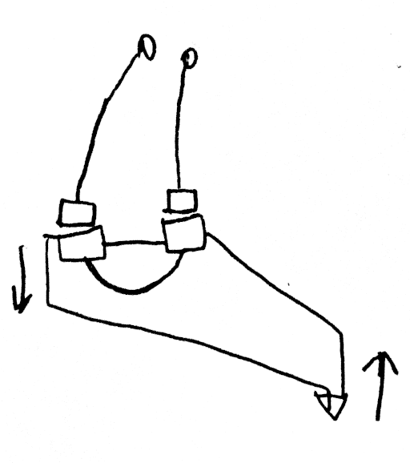

# Various ideas published to establish prior art, mostly 3D printing related. 

## Pythagoras:

https://youtube.com/playlist?list=PLt8GA9Tif0MCI780DuS0Yf162f6rO9wMg

# Statics

## 3D printer kinematics

Consisting of a sliding bearing on a flat surface, moved around by an arrangement of cables. The print head is mounted upon the bearing. 

The bearing block's mass can be partially decoupled from high frequency components of the motion of the printhead through the use of a flexure pivot with damping.

The flat surface could have positioning information for closed loop positioning and/or calibration information. For example the surface could be glass, with the positioning information engraved on the back of the glass, read optically. Or a ferromagnetic surface could have magnetic positioning information.

## Cartesian version of the above

todo

## "Marionette" parallel cable robot cable tensioner (to avoid wasting motor torque on tensioning)

[Video](https://www.youtube.com/watch?v=OGiijvV2sIw)

[Motorized video](https://youtu.be/3ctT8vhLEVk)

A scaled down version of the cable robot (2D or 3D), with each cable replaced with a pivoting rod (performing identical movement), can be used to provide counter-tension on the ropes (the length of the rod sticking out behind the pivot is proportional to the cable length that needs to be drawn from the cable robot). Scaling can be done with block-and-tackle arrangement or coaxial winches or pulleys of different diameters, or any other scaling mechanism. Springs can be used to compensate for imprecision in the assembly.

Only one cable is shown; all other cables work similarly, going to the corresponding rods.

## Compact version of parallel cable robot tensioner

A tapered conical winch takes up the amount of cable proportional to rotation angle squared.

That allows to mechanically compute square & square root.

A differential gearing or a block and tackle arrangement with 1 idler allows to compute a sum or difference. A constant can be added or subtracted by adding an offset.

Thus an arrangement of conical winches, cylindrical winches, and blocks and tackles or differentials can compute $l = \sqrt{x^2+y^2}$ for each cable in a parallel cable robot, from Cartesian xy or xyz position. 

## Rotary delta with cable drive, parallel SCARA with cable drive

jointly with Numbat from Armchair Engineering discord:

A rotary delta robot with cables used to drive "upper arms". The same mechanism as Pythagoras. 

Alternatively: 2 cables are used per arm, one as an extensor other as flexor, 
at least one cable goes to variable-diameter helical groove winch (through a spring to maintain tension) Other can go to a variable radius winch or a plain winch. Variable diameter winch is shaped to maintain cable tension as the motor rotates. 

## Magnetic bed probe / simplified clicky / unclicky:

2 or 3 magnets attach the probe to the carriage when it is deployed, similar to Clicky and Unclicky probes (which were the direct inspiration). When the probe is pushed into the bed, one magnet disconnects. In the probe, magnets are connected with a wire, on the dock sense wires are attached to the magnets.

Possible variations: an omnidirectional probe (similar to CNC probes) for probing edges of the bed.

## Fully constrained tensegrity straight line mechanism (e.g. for bed or xy frame movement in a 3D printer or generally for linear movement without the use of linear rails):

[Video](https://youtu.be/cEeoZqRsgvY)

A print bed is supported at 3 points, which can be located in the middles of 3 edges of the bed. Each point is supported with 2 cables going to two points above or below the bed. There are total of 6 cables, providing 6-DOF rigidity (like Stewart platform).

All cables are winched together at the same rate. The winches can use a helical groove to keep cable from overlapping itself. The winches could be constant or variable diameter (tapered).

If gravity or springs are inadequate for counter-tension, counter-tension can be provided by one or more cables placed in opposition to the 6 positioning cables, would onto a variable-diameter pulley on the same shaft (they wind in the opposite direction). The variable diameter pulley is shaped to ensure that correct length of cable is metered out.
Adding springs to extra cables would eliminate backlash and allow for slight imprecision in the mechanism and prevent issues due to system being over-constrained.

## Other tensegrity straight line mechanisms

Easy to make a straight line mechanism with variable-diameter winches. Pretty much cheating.

# Dynamics

## Decreasing inertial forces for short duration accelerations, improving acceleration performance

If an object accelerates to a given speed over a given distance $L$, the acceleration can be computed as $a = {{v^2}\over{2L}}$ . Notably, required acceleration is lower if the distance is greater.

Typical high-acceleration 3D printing move commands consist of a short acceleration phase followed by coasting. 

For example the print head may accelerate to $0.5 m/s$, over the distance of $1 mm$, requiring the acceleration of $125 m/s^2$ (which is somewhat over the limit of current consumer grade 3D printing technology)

Only the position of print head orifice matters for printing quality, however. Slight rotations of the nozzle around the orifice are permissible.

A print head consists of a number of masses, not all of which have to accelerate over the same distance. Fans and other components (e.g. the extruder, also see Flying Extruder on Delta printers) can lag slightly behind the print head.

The "lagging masses" need to be damped with regards to printhead to avoid resonant built up.

## 3D printer hotend assembly on an universal joint flexure or other mechanism with a virtual pivot point at the nozzle orifice. 

Allows use of much of the hotend (or another tool) mass as part of a tuned mass damper, allows partial decoupling from short duration accelerations.

# Scope

While those ideas were initially conceived in relation to the 3D printing, they are generally applicable to a broad range of robotics, including but not limited to: welding, machining, laser etching, pick-and-place, etc.

## Novelty

Who knows? All these ideas are probably 100+ years old in some other context, but people had been patenting use of 100+ year old inventions in the context of 3D printing so it's better to put things clearly in writing with a clear timestamp.

# Sensors

Filament mass sensor that measures filament mass in a given interval by measuring resonance frequency of a resonator that includes a length of the filament. Filament is held between two rollers and vibrated at the natural resonance frequency, additional set of driven "follower" rollers eliminate effects of filament outside the measurement zone. Alternatively the resonator has sufficiently stiff springs that stiffness of the filament is relatively insignificant in comparison.

Capacitive filament diameter sensor that measures filament all around by measuring change in the average dielectric constant within the measurement zone. Possible difficulties: water has very large dielectric constant. Although that can be made use of for moisture content measurements.

# Existing patents

Who knows? I don't know one way or the other.
