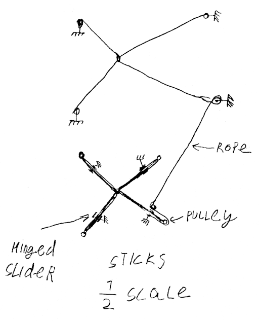
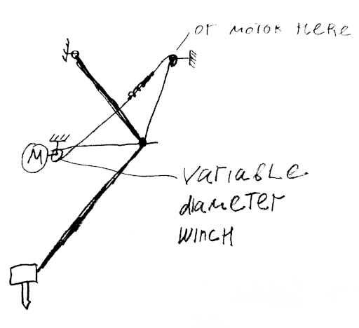

# Various ideas published to establish prior art, mostly 3D printing related.

## Pythagoras:

https://youtube.com/playlist?list=PLt8GA9Tif0MCI780DuS0Yf162f6rO9wMg

# Statics

## 3D printer kinematics

Consisting of a sliding bearing on a flat surface, moved around by an arrangement of cables. The print head is mounted upon the bearing. 

The bearing block's mass can be partially decoupled from high frequency components of the motion of the printhead through the use of a flexure pivot with damping.

## Cartesian version of the above

todo

## Parallel cable robot cable tensioner (to avoid wasting motor torque on tensioning)

A scaled down version of the cable robot (2D or 3D), with each cable replaced with a pivoting rod (performing identical movement), can be used to provide counter-tension on the ropes (the length of the rod sticking out behind the pivot is proportional to the cable length that needs to be drawn from the cable robot). Scaling can be done with block-and-tackle arrangement or coaxial winches or pulleys of different diameters, or any other scaling mechanism. Springs can be used to compensate for imprecision in the assembly.

## Rotary delta with cable drive, parallel SCARA with cable drive

jointly with Numbat from Armchair Engineering discord:

A rotary delta robot with cables used to drive "upper arms". The same mechanism as Pythagoras. 

Alternatively: 2 cables are used per arm, one as an extensor other as flexor, 
at least one cable goes to variable-diameter helical groove winch (through a spring to maintain tension) Other can go to a variable radius winch or a plain winch. Variable diameter winch is shaped to maintain cable tension as the motor rotates. 

## Magnetic bed probe / simplified clicky / unclicky:

2 or 3 magnets attach the probe to the carriage when it is deployed, similar to Clicky and Unclicky probes (which were the direct inspiration). When the probe is pushed into the bed, one magnet disconnects. In the probe, magnets are connected with a wire, on the dock sense wires are attached to the magnets.

Possible variations: an omnidirectional probe (similar to CNC probes) for probing edges of the bed.

# Dynamics

## Decreasing inertial forces for short duration accelerations, improving acceleration performance

If an object accelerates to a given speed over a given distance L, the acceleration can be computed as $a=v^2/(2*L)$ . Notably, required acceleration is lower if the distance is greater.

Typical high-acceleration 3D printing move commands consist of a short acceleration phase followed by coasting. 

For example the print head may accelerate to 0.5 meters per second, over the distance of 1 mm, requiring the acceleration of $125 m/s^2$ (which is somewhat over the limit of current consumer grade 3D printing technology)

Only the position of print head orifice matters for printing quality, however. Slight rotations of the nozzle around the orifice are permissible.

A print head consists of a number of masses, not all of which have to accelerate over the same distance. Fans and other components can lag slightly behind the print head.

The "lagging masses" need to be damped with regards to printhead to avoid resonant built up.

## 3D printer hotend assembly on an universal joint flexure or other mechanism with a virtual pivot point at the nozzle orifice. 

Allows use of much of the hotend (or another tool) mass as part of a tuned mass damper, allows partial decoupling from short duration accelerations.

# Scope

While those ideas were initially conceived in relation to the 3D printing, they are generally applicable to a broad range of robotics, including but not limited to: welding, machining, laser etching, pick-and-place, etc.
